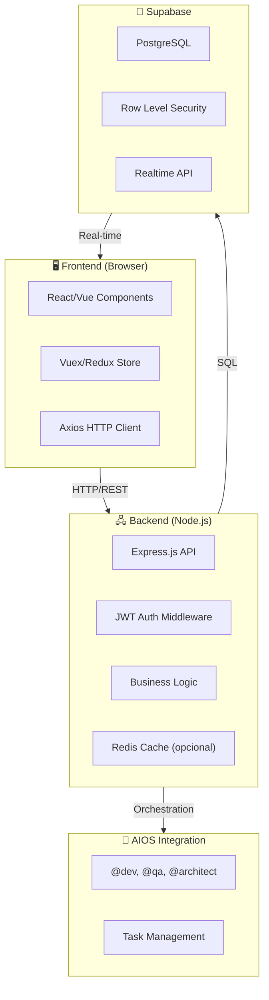

# 🏗️ System Architecture - GPS Dashboard + Sales Clone

**Documento**: System Architecture
**Versão**: 1.0
**Data**: 2026-02-22
**Agente**: @architect (Aria)
**Status**: FASE 3 - Documentação Completa

---

## 📋 Sumário Executivo

O **GPS Dashboard** é um sistema de visualização de vendas baseado no **SALESDASH** (https://salesdash.vende-c.com.br). O projeto combina:

- **Backend**: Node.js + Express + Supabase PostgreSQL
- **Frontend**: React/Vue + Tailwind CSS
- **Autenticação**: JWT + Sessão
- **Arquitetura**: MVC com componentes isolados

**Stack Total**:
- Node.js v20+
- Express.js (backend)
- React 18 ou Vue 3 (frontend)
- Supabase (PostgreSQL + Auth)
- Tailwind CSS (styling)
- Axios (HTTP client)
- AIOS Core (orchestração)

---

## 🎯 Objetivos do Sistema

1. **Dashboard de Vendas**: Visualizar métricas em tempo real
2. **Busca Integrada**: Buscar transações, clientes, produtos
3. **Autenticação Segura**: Login com email/senha
4. **Configurações de Usuário**: Preferências personalizadas
5. **Escalabilidade**: Preparado para crescimento

---

## 🏛️ Arquitetura de Alto Nível



---

## 📦 Estrutura de Pastas

```
gps-dashboard/
│
├── 📁 src/                          # Código frontend
│   ├── 📁 components/               # Componentes React/Vue
│   │   ├── 📁 common/               # Componentes reutilizáveis
│   │   │   ├── Button.jsx
│   │   │   ├── Card.jsx
│   │   │   ├── Header.jsx
│   │   │   └── Sidebar.jsx
│   │   ├── 📁 dashboard/            # Componentes específicos do dashboard
│   │   │   ├── ChartCard.jsx
│   │   │   ├── KPICard.jsx
│   │   │   ├── SalesChart.jsx
│   │   │   └── Timeline.jsx
│   │   ├── 📁 auth/                 # Componentes de autenticação
│   │   │   ├── LoginForm.jsx
│   │   │   ├── LogoutButton.jsx
│   │   │   └── ProtectedRoute.jsx
│   │   └── 📁 settings/             # Componentes de configurações
│   │       ├── ProfileSettings.jsx
│   │       └── PreferencesSettings.jsx
│   │
│   ├── 📁 pages/                    # Páginas da aplicação
│   │   ├── LoginPage.jsx
│   │   ├── DashboardPage.jsx
│   │   ├── SearchPage.jsx
│   │   ├── SettingsPage.jsx
│   │   └── 404Page.jsx
│   │
│   ├── 📁 services/                 # Serviços de API
│   │   ├── api.js                   # Configuração Axios
│   │   ├── authService.js           # Autenticação
│   │   ├── salesService.js          # Dados de vendas
│   │   ├── userService.js           # Dados do usuário
│   │   └── searchService.js         # Busca
│   │
│   ├── 📁 hooks/                    # Custom React hooks
│   │   ├── useAuth.js               # Hook de autenticação
│   │   ├── useFetch.js              # Hook de fetch
│   │   ├── useLocalStorage.js       # Persistência local
│   │   └── useSales.js              # Hook de dados de vendas
│   │
│   ├── 📁 utils/                    # Funções utilitárias
│   │   ├── formatters.js            # Formatação de dados
│   │   ├── validators.js            # Validadores
│   │   ├── constants.js             # Constantes
│   │   └── helpers.js               # Funções auxiliares
│   │
│   ├── 📁 styles/                   # Estilos globais
│   │   ├── globals.css
│   │   ├── variables.css
│   │   └── tailwind.config.js
│   │
│   ├── 📁 store/                    # Estado global (Redux/Vuex)
│   │   ├── store.js
│   │   ├── 📁 slices/
│   │   │   ├── authSlice.js
│   │   │   ├── salesSlice.js
│   │   │   └── uiSlice.js
│   │   └── 📁 reducers/
│   │       └── rootReducer.js
│   │
│   ├── App.jsx                      # Componente raiz
│   ├── index.jsx                    # Entry point
│   └── config.js                    # Configurações da app
│
├── 📁 backend/                      # Código backend (Node.js)
│   ├── 📁 routes/                   # Rotas da API
│   │   ├── auth.routes.js           # /api/auth/*
│   │   ├── sales.routes.js          # /api/sales/*
│   │   ├── users.routes.js          # /api/users/*
│   │   ├── search.routes.js         # /api/search/*
│   │   └── health.routes.js         # /api/health
│   │
│   ├── 📁 controllers/              # Lógica de controle
│   │   ├── authController.js
│   │   ├── salesController.js
│   │   ├── userController.js
│   │   └── searchController.js
│   │
│   ├── 📁 models/                   # Modelos de dados
│   │   ├── User.js
│   │   ├── Sale.js
│   │   ├── Customer.js
│   │   └── Product.js
│   │
│   ├── 📁 middleware/               # Middlewares
│   │   ├── auth.middleware.js       # Validação JWT
│   │   ├── errorHandler.js          # Tratamento de erros
│   │   ├── logger.js                # Logging
│   │   ├── validator.js             # Validação de dados
│   │   └── cors.middleware.js       # CORS
│   │
│   ├── 📁 database/                 # Configuração do banco
│   │   ├── connection.js            # Conexão Supabase
│   │   ├── 📁 migrations/           # Migrações SQL
│   │   │   ├── 001_init.sql
│   │   │   ├── 002_add_users.sql
│   │   │   └── 003_add_sales.sql
│   │   └── 📁 seeds/                # Dados iniciais
│   │       └── seed.sql
│   │
│   ├── 📁 utils/                    # Utilitários do backend
│   │   ├── jwt.js                   # JWT token handling
│   │   ├── encryption.js            # Criptografia
│   │   └── validators.js            # Validadores
│   │
│   ├── app.js                       # Express app setup
│   ├── server.js                    # Entry point
│   └── config.js                    # Configurações
│
├── 📁 docs/                         # Documentação
│   ├── 📁 architecture/
│   │   ├── system-architecture.md   # Este arquivo
│   │   ├── data-flow.md
│   │   └── deployment.md
│   ├── 📁 api/
│   │   ├── auth-api.md
│   │   ├── sales-api.md
│   │   └── search-api.md
│   ├── 📁 database/
│   │   ├── schema.md
│   │   └── migrations.md
│   ├── 📁 frontend/
│   │   ├── frontend-spec.md
│   │   ├── components.md
│   │   └── styling.md
│   ├── SALESDASH-ANALYSIS.md
│   ├── BROWN-DISCOVERY-PLAN.md
│   └── API-DOCUMENTATION.md
│
├── 📁 tests/                        # Testes
│   ├── 📁 unit/
│   │   ├── auth.test.js
│   │   ├── sales.test.js
│   │   └── utils.test.js
│   ├── 📁 integration/
│   │   ├── api.test.js
│   │   └── database.test.js
│   └── 📁 e2e/
│       ├── login.e2e.js
│       └── dashboard.e2e.js
│
├── 📁 .aios/                        # Configuração AIOS
│   ├── agents.yaml
│   ├── tasks.yaml
│   └── workflows.yaml
│
├── 📄 .env                          # Variáveis de ambiente
├── 📄 .env.example                  # Template de .env
├── 📄 .gitignore
├── 📄 .eslintrc.js                  # ESLint config
├── 📄 .prettierrc                   # Prettier config
├── 📄 docker-compose.yml            # Docker setup
├── 📄 Dockerfile                    # Container setup
├── 📄 package.json                  # Dependências
├── 📄 tsconfig.json                 # TypeScript config (opcional)
├── 📄 vite.config.js                # Vite config (se usar)
├── 📄 webpack.config.js             # Webpack config (se usar)
└── 📄 README.md
```

---

## 🔗 Fluxo de Dados

### 1. **Autenticação (Login)**

```
User Input
    ↓
LoginForm (React)
    ↓
authService.login(email, password)
    ↓
POST /api/auth/login (Axios)
    ↓
Backend: authController.login()
    ↓
Supabase: Validar credenciais
    ↓
Gerar JWT Token
    ↓
Retornar {token, user}
    ↓
Store token no localStorage/sessionStorage
    ↓
Redirecionar para /dashboard
```

### 2. **Carregamento do Dashboard**

```
DashboardPage monta
    ↓
useAuth() valida token
    ↓
useSales() busca dados
    ↓
GET /api/sales/metrics (com JWT)
    ↓
Backend valida JWT
    ↓
Query Supabase (com RLS)
    ↓
Retorna dados filtrados
    ↓
Store atualiza state
    ↓
Componentes renderizam gráficos
```

### 3. **Busca**

```
User digita na SearchBox
    ↓
Debounce 300ms
    ↓
GET /api/search?q=termo
    ↓
Backend:
  - Busca em Sales
  - Busca em Customers
  - Busca em Products
    ↓
Retorna resultados combinados
    ↓
Exibe resultados em dropdown
```

---

## 🔐 Segurança

### Autenticação
- **JWT**: Token de autenticação com expiração
- **Refresh Token**: Renovação automática
- **HttpOnly Cookies**: Armazenamento seguro
- **CORS**: Validação de origem

### Autorização
- **RLS (Row Level Security)**: No PostgreSQL
- **Roles**: Admin, User, Guest
- **Permissões**: Por endpoint

### Criptografia
- **Senhas**: Bcrypt + salt
- **Dados sensíveis**: AES-256
- **HTTPS/TLS**: Em produção

### Validação
- **Input Validation**: Schema Joi/Zod
- **Output Sanitization**: XSS prevention
- **SQL Injection**: Prepared statements

---

## 📊 Banco de Dados (Supabase/PostgreSQL)

### Tabelas Principais

#### Users
```sql
CREATE TABLE users (
  id UUID PRIMARY KEY,
  email VARCHAR(255) UNIQUE NOT NULL,
  password_hash VARCHAR(255) NOT NULL,
  name VARCHAR(255),
  role ENUM('admin', 'user') DEFAULT 'user',
  settings JSONB DEFAULT '{}',
  created_at TIMESTAMP DEFAULT NOW(),
  updated_at TIMESTAMP DEFAULT NOW()
);
```

#### Sales
```sql
CREATE TABLE sales (
  id UUID PRIMARY KEY,
  user_id UUID REFERENCES users(id),
  customer_id UUID REFERENCES customers(id),
  product_id UUID REFERENCES products(id),
  amount DECIMAL(10,2) NOT NULL,
  status ENUM('pending', 'completed', 'cancelled') DEFAULT 'completed',
  date TIMESTAMP DEFAULT NOW(),
  created_at TIMESTAMP DEFAULT NOW()
);
```

#### Customers
```sql
CREATE TABLE customers (
  id UUID PRIMARY KEY,
  name VARCHAR(255) NOT NULL,
  email VARCHAR(255),
  phone VARCHAR(20),
  company VARCHAR(255),
  created_at TIMESTAMP DEFAULT NOW()
);
```

#### Products
```sql
CREATE TABLE products (
  id UUID PRIMARY KEY,
  name VARCHAR(255) NOT NULL,
  description TEXT,
  price DECIMAL(10,2),
  category VARCHAR(100),
  created_at TIMESTAMP DEFAULT NOW()
);
```

---

## 🌐 API Endpoints

### Autenticação
```
POST   /api/auth/register          # Registrar novo usuário
POST   /api/auth/login             # Login
POST   /api/auth/logout            # Logout
POST   /api/auth/refresh           # Refresh token
POST   /api/auth/reset-password    # Recuperar senha
```

### Vendas
```
GET    /api/sales                  # Listar todas as vendas
GET    /api/sales/:id              # Detalhes de uma venda
POST   /api/sales                  # Criar nova venda
PUT    /api/sales/:id              # Atualizar venda
DELETE /api/sales/:id              # Deletar venda
GET    /api/sales/metrics/summary  # KPIs principais
```

### Usuários
```
GET    /api/users/me               # Dados do usuário atual
PUT    /api/users/me               # Atualizar perfil
PUT    /api/users/settings         # Atualizar configurações
```

### Busca
```
GET    /api/search?q=termo         # Busca global
GET    /api/search/sales?q=termo   # Busca em vendas
GET    /api/search/customers?q=termo
GET    /api/search/products?q=termo
```

---

## 🚀 Deployment

### Ambiente de Desenvolvimento
```bash
npm install
npm run dev
# http://localhost:3000 (frontend)
# http://localhost:5000 (backend)
```

### Ambiente de Staging
```
Frontend: Vercel
Backend: Render/Heroku
Database: Supabase (staging)
```

### Ambiente de Produção
```
Frontend: Vercel/Cloudflare
Backend: AWS Lambda/Render
Database: Supabase (production)
CDN: Cloudflare
```

---

## 🏛️ Padrões de Código

### Componentes React

```javascript
// ✓ Bom
export function SalesChart({ data, title }) {
  const [loading, setLoading] = React.useState(false);

  return (
    <Card>
      <h2>{title}</h2>
      {loading ? <Spinner /> : <Chart data={data} />}
    </Card>
  );
}

// ✗ Evitar
function Component() {
  return <div dangerouslySetInnerHTML={...} />;
}
```

### Serviços HTTP

```javascript
// ✓ Bom
const API = axios.create({
  baseURL: process.env.REACT_APP_API_URL,
  headers: {
    'Authorization': `Bearer ${token}`
  }
});

// ✗ Evitar
fetch('https://api.example.com/...');
```

### Tratamento de Erros

```javascript
// ✓ Bom
try {
  const data = await salesService.fetch();
} catch (error) {
  logger.error('Failed to fetch sales', { error });
  throw new Error('Failed to fetch sales data');
}

// ✗ Evitar
try { ... } catch (e) { console.log(e); }
```

---

## ⚙️ Integração AIOS

### Agentes Disponíveis

| Agente | Responsabilidade |
|--------|------------------|
| @dev | Implementação de features |
| @qa | Testes e validação |
| @architect | Design e arquitetura |
| @pm | Planejamento e roadmap |
| @data-engineer | Schema e otimização DB |
| @ux-design-expert | Design e UX |

### Fluxo de Desenvolvimento AIOS

```
@pm: Criar story
  ↓
@dev: Implementar
  ↓
@qa: Testar
  ↓
@architect: Revisar
  ↓
Merge e Deploy
```

---

## 📈 Escalabilidade

### Otimizações Planejadas

1. **Caching**
   - Redis para dados frequentes
   - Cache HTTP headers

2. **Database**
   - Índices em queries frequentes
   - Particionamento de tabelas grandes
   - Replicação para failover

3. **Frontend**
   - Code splitting
   - Lazy loading
   - Progressive Web App (PWA)

4. **Backend**
   - Horizontal scaling (multiple instances)
   - Load balancing
   - Rate limiting

---

## 📋 Débitos Técnicos Identificados

| Débito | Severidade | Impacto | Estimativa |
|--------|-----------|---------|-----------|
| Falta de testes automatizados | Alta | Qualidade | 8h |
| Sem logging centralizado | Média | Debugging | 4h |
| Validação inconsistente | Média | Segurança | 6h |
| Documentação incompleta | Baixa | Onboarding | 3h |
| Performance de gráficos | Média | UX | 5h |

---

## 🎯 Critérios de Sucesso

- [x] Arquitetura documentada
- [ ] Prototipo funcional
- [ ] 80%+ test coverage
- [ ] Performance <3s load time
- [ ] Zero security vulnerabilities
- [ ] Deployment automatizado

---

## 📚 Referências

- [SALESDASH Analysis](../SALESDASH-ANALYSIS.md)
- [React Best Practices](https://react.dev)
- [Node.js Best Practices](https://github.com/goldbergyoni/nodebestpractices)
- [PostgreSQL Security](https://www.postgresql.org/docs/current/sql-syntax.html)

---

*Documento mantido por @architect | Última atualização: 2026-02-22*
